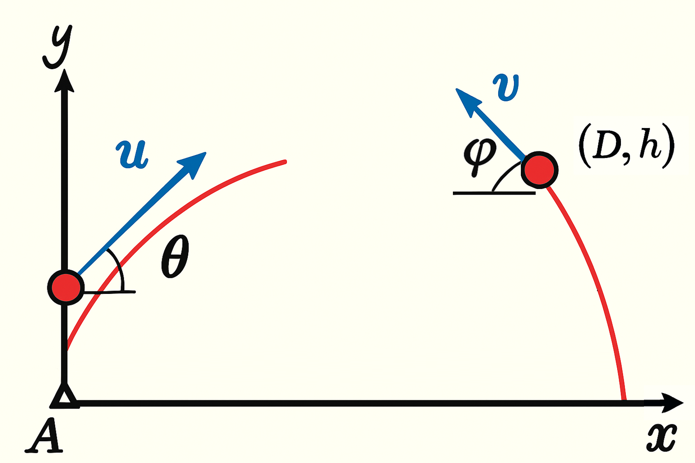

# Descripción

Un proyectil es disparado desde la posición $(D,h)$ con velocidad inicial $v$ y ángulo $\phi$, como se ve en la figura.

Luego de $T$ segundos, usted debe lanzar otro proyectil desde la posición $(0,0)$ con velocidad inicial $u$ y ángulo $\theta$, de tal forma que ambos proyectiles colisionen en el aire.

# Indicaciones
* Realice el desarrollo matemático necesario para determinar las ecuaciones de movimiento de ambos proyectiles, de tal forma que ambos colisionen en el aire.
* Implemente una interfaz gráfica GUI en Python que permita ingresar los parámetros iniciales del primer proyectil y el tiempo $T$.
* Aplique al menos dos métodos numéricos para encontrar los valores de $u$ y $\theta$ para el segundo proyectil. Compare los métodos seleccionados.
* Simule los efectos del viento en la trayectoria de ambos proyectiles añadiendo ruido blanco a las componentes horizontales y verticales de la velocidad cada $\Delta t$ segundos.
* Realice un análisis de la complejidad de la solución implementada, además de los recursos computacionales utilizados.
* Realice una animación que muestre la trayectoria de ambos proyectiles hasta el punto de colisión.

# Parámetros de entrada
* $(D, h)$ - posición inicial del primer proyectil.
* $v$ - velocidad inicial.
* $\phi$ - ángulo de lanzamiento (en grados).
* $T$ - tiempo después del cual se lanza el segundo proyectil.

# Parámetros de salida
* $u$ - velocidad inicial del segundo proyectil.
* $\theta$ - ángulo de lanzamiento del segundo proyectil (en grados).